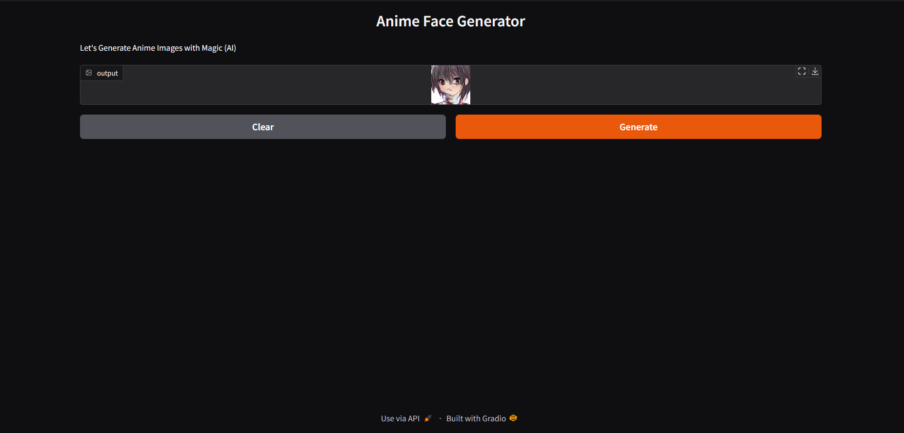

# Anime Face Generator

Generate anime faces using a DCGAN model deployed with Gradio.

## Usage
Click the "Generate" button to create a new anime face!

## Development
1. Clone repository
2. Install requirements: `pip install -r requirements.txt`  
3. Run app: `python app.py`

## Demo Link

## ScreenShot

